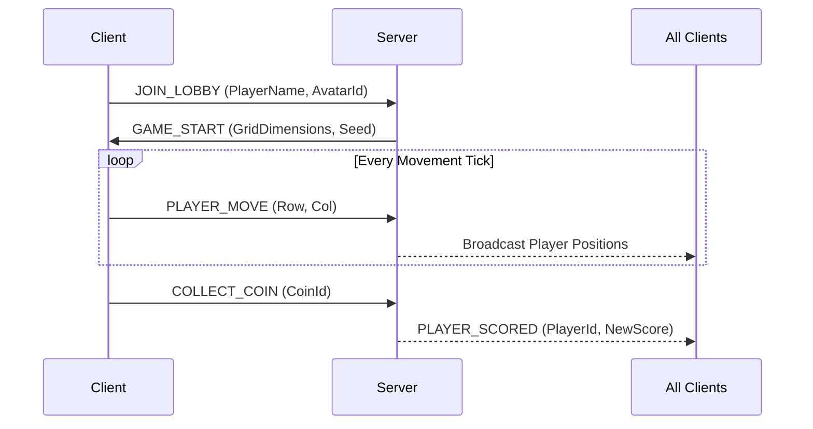

# LAN Maze Game - Client-Server Protocol Specification

## Packet Framing
All network communication occurs over raw TCP sockets on port `12345`.

```mermaid
sequenceDiagram
    Client->>Server: JOIN_LOBBY (PlayerName, AvatarId)
    Server->>Client: GAME_START (GridDimensions, Seed)
    loop Every Movement Tick
        Client->>Server: PLAYER_MOVE (Row, Col)
        Server-->>All Clients: Broadcast Player Positions
    end
    Client->>Server: COLLECT_COIN (CoinId)
    Server-->>All Clients: PLAYER_SCORED (PlayerId, NewScore)
```
